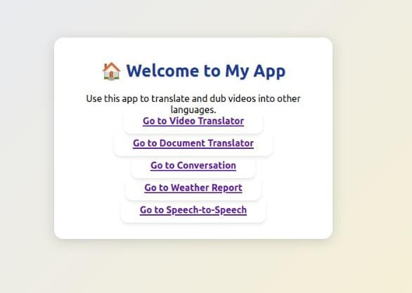
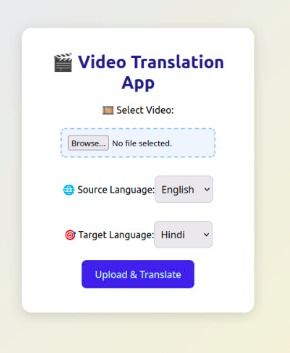
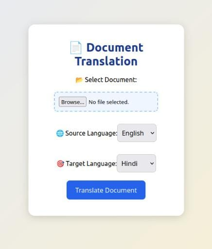
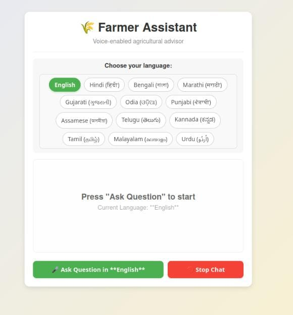
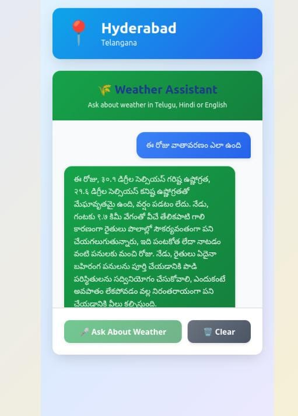
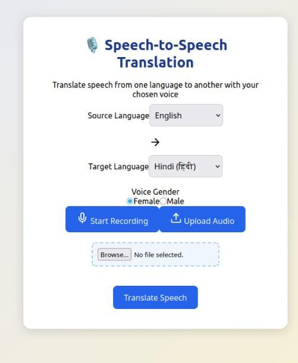

# Agriculture Multimodal Translator (Powered by Bhashini Models)

**Megathon Project: Innovative solutions leveraging Bhashini Models (ASR, MT, TTS, OCR)**  
**Domain:** Agriculture

##  Project Description

A **mobile‑responsive web application** that enables seamless **cross‑language communication** for farmers, agricultural extension workers. The application harnesses the power of **Bhashini’s AI models** — including **Optical Character Recognition (OCR)**, **Machine Translation (MT)**, **Text‑to‑Speech (TTS)**, and **Automatic Speech Recognition (ASR)** — to bridge language gaps in agricultural communication.

---


## Key Features / Use Cases


### 1. OCR-based Document Translation
- Scan or upload printed material (e.g., pamphlets, manuals, guidelines with any extension of documents and images(.pdf , .doc,.jpeg,.png etc)).
- Extracted text is translated and displayed on page into the user’s native language using **Bhashini MT**.
- Enables farmers to **quickly translate printed materials** such as manuals, pamphlets, and guidelines into their native language.
- Makes critical agricultural information **accessible and easy to understand**, regardless of literacy or language barriers.

### 2.  Video → Speech → Text → Native Language Translation
- Upload or stream agricultural videos.
- Extract spoken content using **ASR**, convert to text.Translate and render into native language using **MT** and **TTS**.
 Transforms agricultural videos into **translated, readable, and audible content**.
- Helps farmers **grasp instructions, demonstrations, or training content** in their preferred language without missing key details.


### 3.  Localized Weather 
- Provides **real-time, regional weather updates** in local languages.
- Supports farmers in **making informed decisions** about sowing, irrigation, harvesting, and crop protection.
- Fetch weather data using location.


### 4.  Agriculture Chatbot
- Offers a **conversational AI assistant** for queries about crops, farming practices, and government schemes.
- Enhances **instant access to guidance**, enabling smarter and faster decision-making in the field.
- Speech input/output enabled via **ASR** and **TTS** in the user’s preferred language.


### 5. Speech-to-Speech Translation
- Enables seamless **oral communication across languages** for farmers and agricultural workers.
- Users can speak in one language, and the app instantly **translates and voices the message** in another language.
- Supports **male and female voices**, making the communication natural and clear.
- Ideal for conveying **important farming instructions, market updates, or government advisories** in the listener’s preferred language.
- Helps bridge **language barriers** in rural areas, promoting better understanding and timely action.


---

## Technologies Used

- **Frontend:**  React.js 
- **Backend:** FastAPI , Python 
- **Bhashini Models:**
  - **ASR:** Automatic Speech Recognition
  - **MT:** Machine Translation
  - **TTS:** Text-to-Speech
  - **OCR:** Optical Character Recognition
- **APIs / Libraries:**
  - Bhashini API
  - Weather API 
  - Groq API

---

## Application Overview:

###  Welcome / Home Page


<!--  -->



The **Welcome Page** serves as the main entry point for users into the **Agriculture Multimodal Translator** app. It provides an intuitive interface that clearly presents the four core functionalities offered by the platform.


- **Title:** "Welcome to My App" – Welcoming users to the platform with a clear heading.
- **Subtitle:** A brief line informing users that the app allows them to translate and dub videos into other languages.
- **Navigation Links:**
  - 🔗 **Go to Video Translator:** Redirects users to upload or stream agricultural videos and begin the video translation process.
  - 🔗 **Go to Document Translator:** Takes users to the page where they can scan or upload agricultural documents/images for OCR-based translation.
  - 🔗 **Go to Conversation:** Directs users to the multilingual chatbot interface for farming-related queries via speech/text.

##  Video Translation Page

### Screenshot  


<!--  -->
The **Video Translation Page**  enables users to **translate agricultural videos** into their preferred languages effortlessly.  

- **Upload Video:** Users can select or drag-and-drop a video file for translation.  
- **Source Language:** Choose the original language of the video.  
- **Target Language:** Select the language into which the video’s audio or subtitles should be translated.  
- **Translate Button:** Once uploaded, the video’s speech is processed using **Bhashini ASR (Speech-to-Text)**, translated via **Bhashini MT (Machine Translation)**, and finally converted into speech using **Bhashini TTS (Text-to-Speech)**.  

This feature helps farmers and agricultural workers **understand videos from different regions and languages**, making agricultural knowledge more accessible.

---
## Document Translator Page



This page allows users to **upload documents** and translate them from one language to another using **Bhashini's Machine Translation (MT)**.


- **Upload Document:** Choose any file (e.g., .pdf, .docx, .txt, .png, .jpeg).
- **Select Source Language:** Choose the original language of the document.
- **Select Target Language:** Choose the language to translate the document into.
- **Translate Button:** Click to translate the document content.


A farmer uploads a document/manual in English and selects Hindi as the target language. The app translates the content, making it easier for them to understand.


## Farmer Assistant Page

### Screenshot  


The **Farmer Assistant** page provides a **voice-enabled agricultural chatbot** that supports multiple Indian languages like **Telugu, Hindi, and English**.  

- **Voice Input:** Users can press **Start Recording** to ask questions verbally.  
- The question is recognized using **Bhashini ASR**, translated using **MT**, and answered through **Text-to-Speech (TTS)** in the selected language.  
- **Stop Chat:** Allows the user to end the conversation anytime.  

This feature acts as a **digital farming advisor**, helping farmers get instant answers about **crop care, weather, fertilizer use, and government schemes**, even if they are not fluent in English.


## Weather Assistant Page



This page helps users get **localized weather updates** in their **preferred language** (Telugu, Hindi, or English), using speech or text input.

- **Location-Based Updates:** Automatically fetches weather based on the user's location (e.g., Hyderabad, Telangana).
- **Multilingual Input Support:** Ask weather-related questions in **Telugu, Hindi, or English**.
- **Response in Native Language:** Weather information is displayed in the same language as the query.
- **Voice/Typed Input:** Supports both **spoken** and **typed** queries.
- **Buttons:**
  - **Ask About Weather:** Triggers the weather information response.
  - **Clear:** Clears the chat box.

A farmer in Telangana types or speaks a weather-related question in **Telugu**. The assistant responds with a detailed **weather forecast** in Telugu, helping them plan agricultural activities effectively.


## Speech-to-Speech Translation Page



This page allows users to **translate speech** from one language to another and **hear it back** in the chosen voice (male or female), using **Bhashini's ASR, MT, and TTS models**.


- **Source Language:** Choose the original spoken language.
- **Target Language:** Choose the language to translate the speech into.
- **Voice Gender:** Select Male or Female for the translated voice.
- **Start Recording:** Record your voice directly in the browser.
- **Upload Audio:** Upload a pre-recorded audio file for translation.
- **Translate Speech Button:** Converts speech to translated audio .


A farmer speaks in English, and the app translates and speaks back the message in Hindi with a female voice, enabling easy **cross-language verbal communication**.


## Demo

Coming soon...


### How to Run Code?
### SetUp Instructions

``` bash
1. Clone the Repository

git clone https://github.com/yourusername/agriculture-multimodal-translator.git

2. Create and Activate a Virtual Environment

python -m venv venv
source venv/bin/activate      # On macOS/Linux
# On Windows:
venv\Scripts\activate
#installations

pip install fastapi uvicorn[standard] moviepy pydub requests pillow pdf2image werkzeug groq pydantic


3.Run the Backend (FastAPI)

uvicorn main:app --reload


4.Run the Frontend (React)

cd frontend
npm install
npm start

```


### Dependencies

- FastAPI: Web framework
- Uvicorn: ASGI server
- MoviePy: Video processing
- Pydub: Audio processing
- Requests: HTTP requests
- Pillow: Image processing
- pdf2image: PDF to image conversion
- Werkzeug: Utility functions (secure filenames)
- Groq: Custom AI model interface
- Pydantic: Data validation


###
``` bash
1. Clone the Repository

git clone https://github.com/yourusername/agriculture-multimodal-translator.git
cd agriculture-multimodal-translator

2. Create and Activate a Virtual Environment

python -m venv venv
source venv/bin/activate      # On macOS/Linux
# On Windows:
venv\Scripts\activate

3.Run the Backend (FastAPI)

uvicorn main:app --reload


4.Run the Frontend (React)

cd frontend
npm install
npm start

```

